<!-- ============================================================ -->
<!--  Aaditya Padiya · GitHub Profile · v12                       -->
<!--  Animated hero: assets/dark.svg + assets/light.svg (SMIL)    -->
<!--  All visualizations generated by .build/*.py — do not edit   -->
<!--  the SVGs by hand.                                           -->
<!-- ============================================================ -->

<picture>
  <source media="(prefers-color-scheme: dark)" srcset="./assets/dark.svg">
  <source media="(prefers-color-scheme: light)" srcset="./assets/light.svg">
  
</picture>

---

## 🧭 About Me

I'm **Aaditya Padiya**, a **System Administrator** at **CludoBits IT Solutions Pvt. Ltd.** and **Director & CTO** at **Nexovo Tech Services** (Pune, India), with **3+ years** of experience running enterprise IT infrastructure that stays up — **99.9% uptime** across production systems.

- 🖥️ I manage **50+ endpoints, servers, and enterprise networks** — Windows Server, Active Directory, Microsoft Intune, Linux/Ubuntu.
- ☁️ I build on **AWS** — EC2, S3, IAM, VPC, Route53, CloudWatch — plus Vercel and Render for app workloads.
- 🤖 I deploy **AI infrastructure**: LLM integrations with **Ollama** and the **OpenAI API**, model fine-tuning, and AIOps tooling for self-healing systems.
- 🌐 I design **corporate networks** end to end: SonicWALL firewalls with dual-ISP failover, L3 switching, VLAN segmentation, DMZ servers.
- 🔧 I automate with **Docker, CI/CD, GitHub Actions, Shell & PowerShell scripting**, and I've cut incident resolution times by **30–40%** through structured RCA and better monitoring.
- 🎓 BCA — Information Technology, Shri Shivaji Science College, Amravati (2020–2023).

## 🎯 Current Focus

- 🚀 **AI-native reliability automation** — self-healing cloud platforms with real-time incident detection and AI-assisted root-cause analysis.
- 🔗 **Blockchain-verified document intelligence** — on-chain SHA-256 fingerprint verification for compliance workflows.
- 🏗️ **Infrastructure as discipline** — NAS, backup & disaster recovery, patch management, system hardening, endpoint security.

## 🛠️ Tech Stack

### Cloud & Infrastructure

### Systems & Networking

### DevOps & Automation

### AI & Development

## 🏗️ Architecture & Infrastructure

<picture>
  <source media="(prefers-color-scheme: dark)" srcset="./assets/architecture-dark.svg">
  <source media="(prefers-color-scheme: light)" srcset="./assets/architecture-light.svg">
  
</picture>

## 🚀 Projects

<picture>
  <source media="(prefers-color-scheme: dark)" srcset="./assets/projects-dark.svg">
  <source media="(prefers-color-scheme: light)" srcset="./assets/projects-light.svg">
  
</picture>

| Project | Description | Stack | Links |
|---------|-------------|-------|-------|
| **Nexovo Self-Healing Cloud Platform** | AI-native AIOps: real-time incident detection, AI-assisted RCA, escalation workflows, Slack/Jira webhooks | Python · Streamlit · FastAPI · Render | [repo](https://github.com/aadityapa/Self-Healing-Cloud-Platform) |
| **TrustOCR AI** | Blockchain-verified document intelligence: browser OCR, AI structuring, on-chain SHA-256 registry | Next.js · Solidity · Hardhat · Ollama | [repo](https://github.com/aadityapa/ocr) · [live](https://ocr-chi-ivory.vercel.app) |
| **Corporate Network Infrastructure** | Enterprise network for 350 users: SonicWALL TZ540 dual-ISP failover, 9 VLANs, HP Gen10 DMZ | SonicWALL · L3 · VLAN · Firewall | [repo](https://github.com/aadityapa/corporate-network-infrastructure) |
| **HealthEcosystem** | Multi-tenant healthcare SaaS: LIMS, EHR, PMS, billing, PACS/RIS, ABDM, AI | TypeScript · NestJS · Next.js · EKS | [repo](https://github.com/aadityapa/HealthEcosystem-Enterprise-Healthcare-Platform) |
| **EduAI** | Multi-tenant SaaS for AI-powered education (Classes 1–10, CBSE/ICSE/State) | TypeScript · Turborepo · AI | [repo](https://github.com/aadityapa/EduAI) |
| **Real Estate ERP Platform** | Enterprise multi-tenant SaaS for Indian real estate developers | TypeScript · Next.js | [repo](https://github.com/aadityapa/Real-Estate-ERP-Platform) |
| **AI Interview Model** | AI-powered interview platform (Python backend, TypeScript frontend) | Python · TypeScript | [repo](https://github.com/aadityapa/AI-Interview-Model-Backend-v2) · [live](https://ai-interview-model-frontend-v2.vercel.app) |
| **Ritika Infotech** | SEO-optimized business website ranking on Google; domain, hosting & production ops | HTML · CSS · JS · SEO | [live](https://ritikainfotech.in) |

## 🌐 Technology Ecosystem

<picture>
  <source media="(prefers-color-scheme: dark)" srcset="./assets/ecosystem-dark.svg">
  <source media="(prefers-color-scheme: light)" srcset="./assets/ecosystem-light.svg">
  
</picture>

## 🧗 Career Timeline

<picture>
  <source media="(prefers-color-scheme: dark)" srcset="./assets/timeline-dark.svg">
  <source media="(prefers-color-scheme: light)" srcset="./assets/timeline-light.svg">
  
</picture>

## 📊 GitHub Stats

<!-- The canonical github-readme-stats.vercel.app shared instance returned 503
     (public deployment paused — Vercel OSS sponsorship ended, see
     anuraghazra/github-readme-stats#3851). Switched to the community
     HA mirror github-readme-stats.shion.dev, verified live 2026-07-13. -->

  

  

## 🐍 Contribution Snake

<picture>
  <source media="(prefers-color-scheme: dark)" srcset="https://raw.githubusercontent.com/aadityapa/aadityapa/output/github-snake-dark.svg">
  <source media="(prefers-color-scheme: light)" srcset="https://raw.githubusercontent.com/aadityapa/aadityapa/output/github-snake.svg">
  
</picture>

## 🏆 Achievements

<!-- github-profile-trophy.vercel.app now returns 402 Payment Required (shared
     instance paywalled); the trophy embed was removed rather than shipping a
     permanently broken image. Curated achievements below are from the CV. -->

- 🥇 Designed and shipped an enterprise network for **350 users** with dual-ISP failover and 9 segmented VLANs.
- ⏱️ Cut incident resolution times by **30–40%** across two organizations through RCA and monitoring.
- 🤖 Took **LLM-powered systems to production** — fine-tuned, optimized, and integrated for internal business apps.
- 🌐 Shipped an SEO-optimized site that **ranks on Google** and a blockchain document-verification platform.
- 🛡️ Maintains **99.9% uptime** across 50+ endpoints and production servers.

## 📜 Certifications

<picture>
  <source media="(prefers-color-scheme: dark)" srcset="./assets/certifications-dark.svg">
  <source media="(prefers-color-scheme: light)" srcset="./assets/certifications-light.svg">
  
</picture>

## 🤝 Connect With Me

## ☕ Support

If any of my projects helped you, a ⭐ on the repo means a lot — it's how open-source keeps moving.

---

Designed & built with SMIL-animated SVGs · no JavaScript, no external fonts · <a href="./docs/design-system.md">design system</a> · <a href="./docs/animation-report.md">animation report</a> · <a href="./reports/validation-report.md">v12 validation</a>

  

 

© 2026 Aaditya Padiya · Pune, India · <a href="./LICENSE">MIT License</a>

